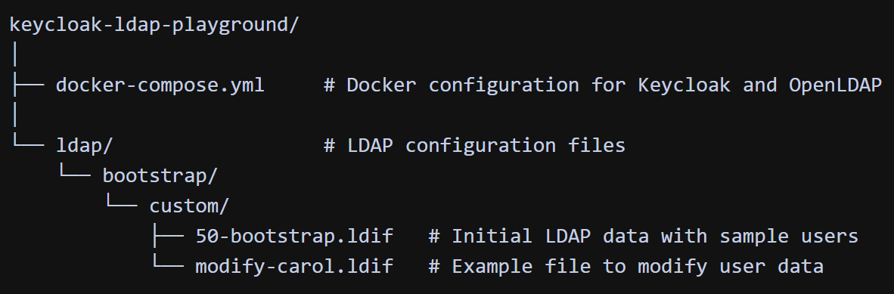

## Overview
This project provides a ready-to-use Docker environment with Keycloak and OpenLDAP, allowing you to experiment with LDAP user federation in Keycloak. The environment comes pre-configured with sample users and the necessary configuration to connect Keycloak to the LDAP directory.
## Setup
1. Clone this repository
2. Run the Docker containers:
```shell
docker-compose up -d
```
## Components
- **Keycloak**: Running on port 8080 with admin credentials (admin/admin)
- **OpenLDAP**: Running on port 389 with admin credentials (cn=admin,dc=example,dc=com/adminpassword)

## LDAP Structure
The LDAP server is initialized with:
- An organizational unit `ou=Users,dc=example,dc=com`
- Three sample users:
    - Alice Smith (uid=alice)
    - Bob Johnson (uid=bob)
    - Carol Lee (uid=carol)

## Managing LDAP Users
### Verify LDAP Users
```shell
docker exec ldap ldapsearch \
  -x \
  -D "cn=admin,dc=example,dc=com" \
  -w adminpassword \
  -b "dc=example,dc=com" \
  "(objectClass=inetOrgPerson)" \
  cn mail
```
### Modify LDAP User
```shell
docker exec ldap ldapmodify \
  -x \
  -H "ldap://127.0.0.1:389" \
  -D "cn=admin,dc=example,dc=com" \
  -w adminpassword \
  -f /container/service/slapd/assets/config/bootstrap/ldif/custom/modify-carol.ldif
```
## Configuring Keycloak LDAP Federation
To connect Keycloak to the LDAP directory:
1. Log in to Keycloak admin console at [http://localhost:8080](http://localhost:8080)
2. Create a new realm or use the master realm
3. Go to User Federation and add a new provider of type LDAP

### LDAP Connection Settings
- **Vendor**: OpenLDAP
- **Connection URL**: ldap://ldap:389
- **Bind DN**: cn=admin,dc=example,dc=com
- **Bind Credential**: adminpassword
- **Users DN**: ou=Users,dc=example,dc=com

### Advanced Settings
- **Edit mode**:
    - READ_ONLY - Keycloak will only read users from LDAP
    - WRITABLE - If you want Keycloak to create or update LDAP entries

- **Username LDAP attribute**: uid
- **RDN LDAP attribute**: uid
- **UUID LDAP attribute**: entryUUID
- **User object classes**: inetOrgPerson, organizationalPerson, person, top

After configuration:
1. Test the connection
2. Test authentication
3. Save and sync all users

## Project Structure
